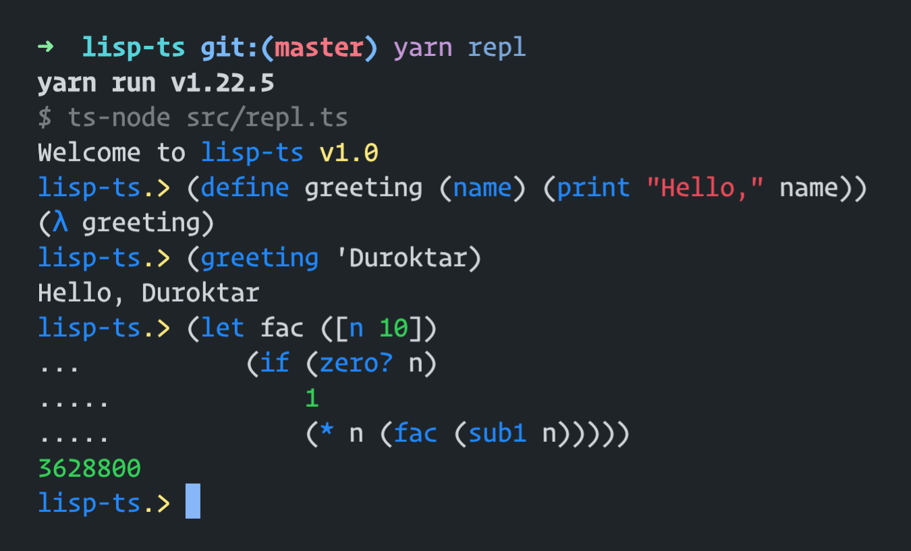

# lisp-ts (tscheme)

## Install

```sh

git clone https://github.com/duroktar/lisp-ts
cd lisp-ts
yarn i
yarn repl

```

## Example



## Spec

```sh

*** Running Tests: spec ***

--- Finished Tests: spec ---
 - Passed:     8
 - Failed:     0
 - Total:      8

*** Running Tests: r5rs ***

--- Finished Tests: r5rs ---
 - Passed:     100
 - Failed:     81
 - Total:      181

```